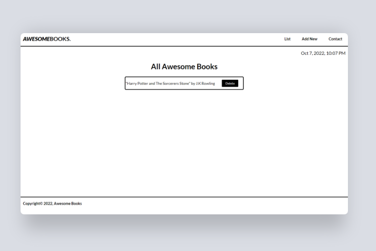

# Awesome Books: with ES6
> This project is a restructure of a previously completed pair-programming project (Awesome Books). The goal is to make it more organized by using modules and the ES6 syntax. The user is able to create and manage reading lists.

## Preview

## Live Demo

Check out the live demo [here](https://shyusu4.github.io/Awesome-Books-ES6/)

## Built with

- HTML/CSS
- JavaScript
- Luxon

## Getting Started

- Clone the repo `git@github.com:shyusu4/Awesome-Books-ES6.git`
- cd `into` the project
- Run `git pull origin app`
- Run `yarn install` or `npm install` to install dependencies
- On the terminal run `npm run start` to open up the live server
- To run tests run `npm run test` on the terminal

## Authors

**Shakhrizoda Yusupova**

- GitHub: [@shyusu4](https://github.com/shyusu4)
- Twitter: [@shyusu4](https://twitter.com/shyusu4)
- LinkedIn: [Shakhrizoda Yusupova](https://www.linkedin.com/in/shyusu4/)

## Contributing
Contributions, issues, and feature requests are welcome!

Feel free to check the [issues page.](https://github.com/shyusu4/Awesome-Books-ES6/issues)

## Show your support
Give a ⭐️ if you like this project!

## Acknowledgments

Microverse

## License

This project is [MIT](https://github.com/shyusu4/Awesome-Books-ES6/blob/ES6/MIT.md) licensed.
